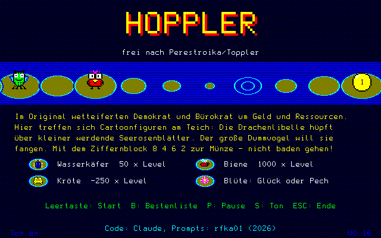
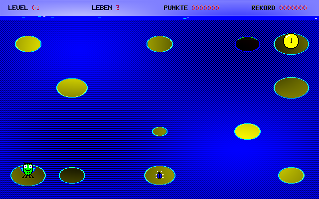

# Hoppler

*frei nach Perestroika/Toppler für die NCR DMV – loosely based on Perestroika/Toppler for the NCR DMV*

Version 0.16 (04.10.2026, Testfassung / test release) – Diskette / disk image: [`../images/HOPPLER-V0.16.IMG`](../images/HOPPLER-V0.16.IMG)

*Screenshots: MAME, Treiber / driver `dmv`*

## Deutsch

Im Original (Perestroika/Toppler, Moskau 1990) wetteiferten Demokrat und Bürokrat um Geld und Ressourcen.
Hier treffen sich Cartoonfiguren am Teich: Die Drachenlibelle hüpft über kleiner werdende Seerosenblätter
zur Münze. Der große Dummvogel will sie fangen.

- 25 Level, Raster wächst wie im Original von 7×4 auf 14×8
- Bonustiere wie im Original: Wasserkäfer (50 × Level), Biene (1000 × Level), Kröte (−250 × Level),
  Seerosenblüte (Glück oder Pech)
- Extraleben bei 10000, 30000, 70000 … Punkten, Statistik nach dem Spiel, Bestenliste (HOPPLER.HI)
- Töne über den Tastatur-Controller der DMV (8741, Befehl 06h)

**Tasten:** Ziffernblock 8/2/4/6 oder Pfeiltasten · P Pause · S Ton an/aus · B Bestenliste (Titel) · ESC Ende
**Start:** `HOPPLER` oder `HOPPLER n` (Start in Level n)
**Braucht:** DMV mit Farbgrafik, 8088-Karte, MS-DOS; CHARGEN0.OVR im selben Verzeichnis.
HOPPLER.DAT (vorberechnete Seerosenbilder) wird beim ersten Start erzeugt, falls sie fehlt.

## English

In the original (Perestroika/Toppler, Moscow 1990) a democrat and a bureaucrat competed for money and
resources. Here cartoon characters meet at a pond: the dragonfly hops across shrinking lily pads towards
the coin while the big dumb bird tries to catch it.

- 25 levels, grid grows from 7×4 to 14×8 as in the original
- Bonus animals as in the original: water beetle, bee, toad, water lily flower
- Extra lives, statistics after the game, high-score list
- Sound via the DMV keyboard controller (8741, command 06h)

**Keys:** numeric keypad 8/2/4/6 or cursor keys · P pause · S sound on/off · B high scores (title) · ESC quit
**Requires:** colour DMV, 8088 board, MS-DOS; CHARGEN0.OVR in the same directory.

## Dateien / Files

| Datei / File | Inhalt / Contents |
|---|---|
| `HOPPLER.PAS` | Quelltext, Turbo Pascal 3.01A (Codepage 437, CRLF) / source code |
| `SPRITES.INC` | Sprites und Umlaute, erzeugt von `tools/mksprites.py` / sprites and umlauts, generated |
| `HOPPLER.TXT` | Kurzanleitung auf der Diskette / readme on the disk |
| `tools/sprites_def.py` | Sprite-Definitionen (ASCII-Raster) / sprite definitions |
| `tools/mksprites.py` | erzeugt SPRITES.INC (braucht CHARGEN0.OVR im Verzeichnis darüber) / generates SPRITES.INC |
| `tools/preview.py` | Vorschau der Sprites als PNG / sprite preview |
| `tools/mkimg.py` | baut das Diskettenabbild aus einer 360-KB-DMV-Vorlage / builds the disk image from a 360 KB DMV template |

## Bauen / Building

Turbo Pascal 3.01A, `HOPPLER.PAS` als Hauptdatei, Compiler-Option C (COM-Datei). Im selben Verzeichnis
müssen `CGRAF.LIB` (TurboGraf 3.2, ComSoft – nicht in diesem Repository) und `SPRITES.INC` liegen.

Turbo Pascal 3.01A, main file `HOPPLER.PAS`, compiler option C (COM file). `CGRAF.LIB` (TurboGraf 3.2,
ComSoft – not included) and `SPRITES.INC` must be in the same directory.

## Lizenz / License

MIT (siehe [../LICENSE](../LICENSE)), ausgenommen CGRAF.LIB und CHARGEN0.OVR (TurboGraf, ComSoft).
Code: Claude (Anthropic) · Idee und Prompts / idea and prompts: rfka01
